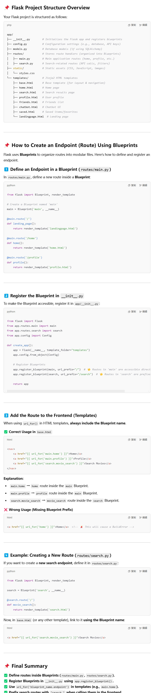

# COMP70085-Team-Project-II

[Click here to check notification board](docs/notification-board.md):
1. Enable multisession chat and deletion. (from: Song)
2. Enable simple substring search in Python. (from: Song)
3. Seperate chatbot-service and chatbot-service. (from: Song)
4. Implement Redis for high-speed caching and PostgreSQL for persistent storage, with support for dynamic loading into the cache and consistency updates. (from: Song) 
5. How to develop the main app? Check this out:

